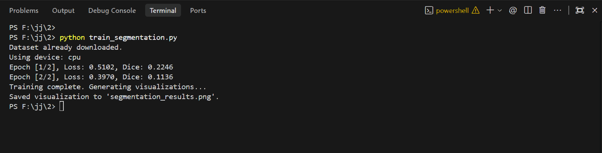
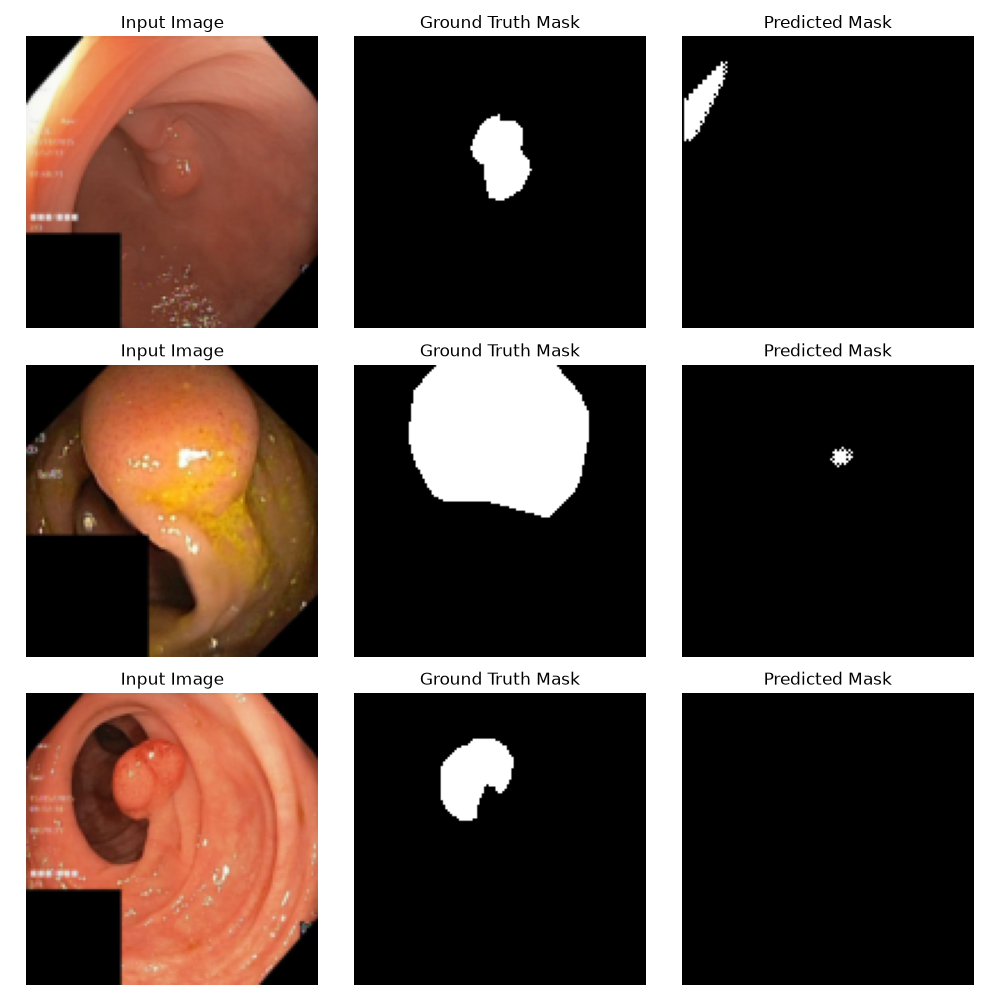
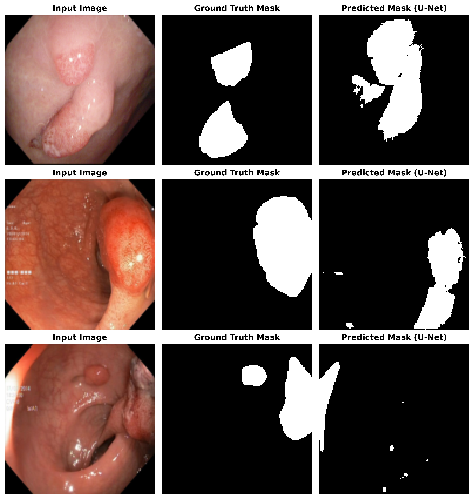

# Medical Image Segmentation using U-Net (Kvasir-SEG)

[](https://www.python.org/)
[](https://pytorch.org/)
[]()
[]()
[](https://datasets.simula.no/kvasir-seg/)

A complete, modular PyTorch implementation of the **U-Net** architecture for semantic segmentation of gastrointestinal polyp images using the **Kvasir-SEG** dataset. This project covers the full end-to-end computer vision workflow from automated dataset acquisition, custom data loading and preprocessing, deep neural network modeling, training and evaluation, to qualitative segmentation visualization.

---

## Table of Contents
- [ Project Overview](#-project-overview)
- [ Repository Structure](#-repository-structure)
- [ Model Architecture (U-Net)](#-model-architecture-u-net)
- [ Dataset Overview](#-dataset-overview)
- [ Quick Start](#-quick-start)
  - [1. Prerequisites & Installation](#1-prerequisites--installation)
  - [2. Run Training & Evaluation](#2-run-training--evaluation)
  - [3. CLI Configuration Options](#3-cli-configuration-options)
- [ Assignment Steps & Implementation](#-assignment-steps--implementation)
  - [Step 1: Dataset Downloading & Preprocessing](#step-1-dataset-downloading--preprocessing)
  - [Step 2: U-Net Architecture](#step-2-u-net-architecture)
  - [Step 3: Training & Evaluation Loop](#step-3-training--evaluation-loop)
  - [Step 4: Qualitative Visualization](#step-4-qualitative-visualization)
- [ Results & Metrics](#-results--metrics)
- [ References & Documentation](#-references--documentation)

---

## Project Overview

Polyps are abnormal tissue growths in the gastrointestinal tract that can be precursors to colorectal cancer. Automatic segmentation of polyps from endoscopic video frames provides critical computer-aided diagnosis (CAD) support for clinicians.

This repository implements:
1. **Automated Data Pipeline**: Automatic download, decompression, normalization, and mask binarization of the Kvasir-SEG dataset.
2. **U-Net Deep Learning Architecture**: Encoder-decoder network with skip connections preserving fine-grained spatial and contextual details.
3. **Training & Metrics**: Binary Cross-Entropy Loss optimization, Dice Similarity Coefficient (DSC), and Intersection over Union (IoU / Jaccard Index) tracking.
4. **Qualitative Output Visualizer**: Side-by-side comparison of raw RGB inputs, ground-truth expert annotations, and predicted polyp segmentations.

---

## Repository Structure

```plaintext
├── assets/
│   └── screenshots/
│       ├── 1.1 Dataset Downloading and Preprocessing.png
│       ├── 1.2 Dataset Downloading and Preprocessing.png
│       ├── 2.1 U-Net Architecture.png
│       ├── 2.2 U-Net Architecture.png
│       ├── 3.1 Training and Evaluation Loop.png
│       ├── 3.2 Training and Evaluation Loop.png
│       ├── 4.png
│       └── segmentation_results.png
├── docs/
│   ├── Computer Vision and Artificial Intelligence.docx
│   ├── Computer Vision and Artificial Intelligence.pdf
│   └── CVAI Set exercise Oct25 G1.pdf
├── src/
│   ├── __init__.py            # Package initialization
│   ├── dataset.py             # Dataset downloader & PyTorch MedicalImageDataset
│   ├── metrics.py             # Dice coefficient and IoU calculation
│   ├── model.py               # U-Net and DoubleConv PyTorch modules
│   ├── train.py               # Full training and validation pipeline with CLI args
│   └── visualize.py           # Plotting predictions vs ground truth
├── .gitignore                 # Git ignore rules for checkpoints & datasets
├── README.md                  # Comprehensive documentation
├── requirements.txt           # Project dependencies
├── segmentation_results.png   # Output prediction visualization plot
├── Medical_Image_Segmentation_UNet_Colab.ipynb  # Interactive Google Colab notebook
├── train_segmentation.ipynb   # Jupyter Notebook runner
└── train_segmentation.py      # Main entry point runner script
```

---

## Model Architecture (U-Net)

The network is based on the canonical **U-Net** architecture (Ronneberger et al.), tailored for biomedical image segmentation:

```
Input (3, H, W)
      │
      ▼
┌──────────────┐
│  down1 (64)  │ ──────────────────────────────┐ (Skip Connection)
└──────┬───────┘                               │
       │ MaxPool (2x2)                         │
       ▼                                       │
┌──────────────┐                               │
│ down2 (128)  │ ────────────────┐ (Skip Conn) │
└──────┬───────┘                 │             │
       │ MaxPool (2x2)           │             │
       ▼                         │             │
┌──────────────┐                 │             │
│ down3 (256)  │ (Bottleneck)    │             │
└──────┬───────┘                 │             │
       │ ConvTranspose2d (2x2)   │             │
       ▼                         │             │
  Concat with down2 ◄────────────┘             │
┌──────────────┐                               │
│ conv1 (128)  │                               │
└──────┬───────┘                               │
       │ ConvTranspose2d (2x2)                 │
       ▼                                       │
  Concat with down1 ◄──────────────────────────┘
┌──────────────┐
│  conv2 (64)  │
└──────┬───────┘
       │ Conv2d (1x1) + Sigmoid
       ▼
Output Mask (1, H, W)
```

- **DoubleConv Block**: Two sequential $3 \times 3$ convolutions with `padding=1`, Batch Normalization, and ReLU activations.
- **Contracting Path (Encoder)**: Progressive spatial downsampling via $2 \times 2$ Max Pooling while doubling feature map channels ($3 \rightarrow 64 \rightarrow 128 \rightarrow 256$).
- **Expanding Path (Decoder)**: Feature map upsampling via $2 \times 2$ Transposed Convolutions (`ConvTranspose2d`) concatenated with high-resolution encoder features via skip connections.
- **Final Output Layer**: $1 \times 1$ Convolution followed by a Sigmoid activation yielding per-pixel probabilities $\in [0, 1]$.

---

## Dataset Overview

- **Name**: [Kvasir-SEG Dataset](https://datasets.simula.no/kvasir-seg/)
- **Total Images**: 1,000 endoscopic gastrointestinal polyp images with corresponding binary segmentation masks verified by expert gastroenterologists.
- **Image Modality**: RGB Endoscopic colonoscopy images.
- **Mask Modality**: Single-channel grayscale binary masks where pixel value $255$ indicates polyp regions and $0$ indicates background mucosa.

---

## Quick Start

### 1. Prerequisites & Installation

Clone the repository and install the required dependencies:

```bash
# Clone the repository
git clone <your-repo-url>
cd <repo-folder>

# (Optional) Create and activate virtual environment
python -m venv venv
# Windows:
.\venv\Scripts\activate
# Linux/macOS:
source venv/bin/activate

# Install dependencies
pip install -r requirements.txt
```

### 2. Run Training & Evaluation

Execute the main training script directly. The script will automatically verify and download the dataset if not already present:

```bash
python train_segmentation.py
```

### 3. CLI Configuration Options

Customize hyper-parameters and runtime configurations via command-line arguments:

```bash
# Run with custom epochs, batch size, learning rate, and full dataset
python train_segmentation.py --epochs 10 --batch_size 16 --lr 0.0005 --subset_size 0 --save_model unet_kvasir_seg.pth
```

| Argument | Type | Default | Description |
|---|---|---|---|
| `--data_dir` | `str` | `Kvasir-SEG` | Path to dataset directory |
| `--img_size` | `int` | `128` | Image height and width (square resize) |
| `--batch_size` | `int` | `8` | Batch size for training DataLoader |
| `--epochs` | `int` | `2` | Number of training epochs |
| `--lr` | `float` | `0.001` | Learning rate for Adam optimizer |
| `--subset_size` | `int` | `100` | Subset size for fast training (`0` for all 1000 images) |
| `--save_model` | `str` | `unet_kvasir_seg.pth` | Checkpoint file destination |
| `--output_image` | `str` | `segmentation_results.png` | Output visualization figure path |
| `--no_cuda` | `flag` | `False` | Force CPU computation |

---

## Assignment Steps & Implementation

### Step 1: Dataset Downloading & Preprocessing
Automated retrieval of the dataset archive, extraction, dynamic resizing to $128 \times 128$, RGB ImageNet normalization ($\mu = [0.485, 0.456, 0.406], \sigma = [0.229, 0.224, 0.225]$), and mask threshold binarization ($> 0.5$).

| Step 1.1 Download & Extraction | Step 1.2 PyTorch Dataset & Mask Transforms |
| :---: | :---: |
|  |  |

---

### Step 2: U-Net Architecture
Implementation of the standard U-Net with contracting layers, bottleneck representation, expanding transposed convolutions, skip-connection concatenation, and pixel-level sigmoid classification.

| Step 2.1 DoubleConv Definition | Step 2.2 U-Net Forward Flow |
| :---: | :---: |
|  |  |

---

### Step 3: Training & Evaluation Loop
Optimization using Binary Cross-Entropy (`BCELoss`), Adam optimizer ($\text{lr} = 10^{-3}$), tracking epoch loss, Dice coefficient, and IoU metric scores across batches.

| Step 3.1 Dice Metric & Dataloader Setup | Step 3.2 Optimization Loop & Epoch Tracking |
| :---: | :---: |
|  |  |

---

### Step 4: Qualitative Visualization
Evaluation mode inference with denormalized RGB image rendering, ground-truth mask overlay, and predicted segmented polyp regions.

| Step 4.1 Visualization Pipeline | Step 4.2 Saved Output Results |
| :---: | :---: |
|  |  |

---

## Results & Metrics

### Mathematical Definitions

- **Binary Cross-Entropy Loss**:
  $$\mathcal{L}_{\text{BCE}} = -\frac{1}{N} \sum_{i=1}^N \left[ y_i \log(\hat{y}_i) + (1 - y_i) \log(1 - \hat{y}_i) \right]$$

- **Dice Similarity Coefficient (DSC)**:
  $$\text{Dice} = \frac{2 \cdot |Y \cap \hat{Y}| + \epsilon}{|Y| + |\hat{Y}| + \epsilon}$$

- **Intersection over Union (IoU / Jaccard Index)**:
  $$\text{IoU} = \frac{|Y \cap \hat{Y}| + \epsilon}{|Y \cup \hat{Y}| + \epsilon}$$

### Sample Qualitative Output


---

## References & Documentation

- **U-Net Paper**: Ronneberger, O., Fischer, P., & Brox, T. (2015). *U-Net: Convolutional Networks for Biomedical Image Segmentation*. MICCAI 2015. [arXiv:1505.04597](https://arxiv.org/abs/1505.04597)
- **Kvasir-SEG Dataset**: Jha, D., Smedsrud, P. H., Riegler, M. A., Halvorsen, P., de Lange, T., Johansen, D., & Pogorelov, K. (2020). *Kvasir-SEG: A Segmented Polyp Dataset*. MMM 2020.
- Assignment documentation and guides are preserved in [`docs/`](docs/).
